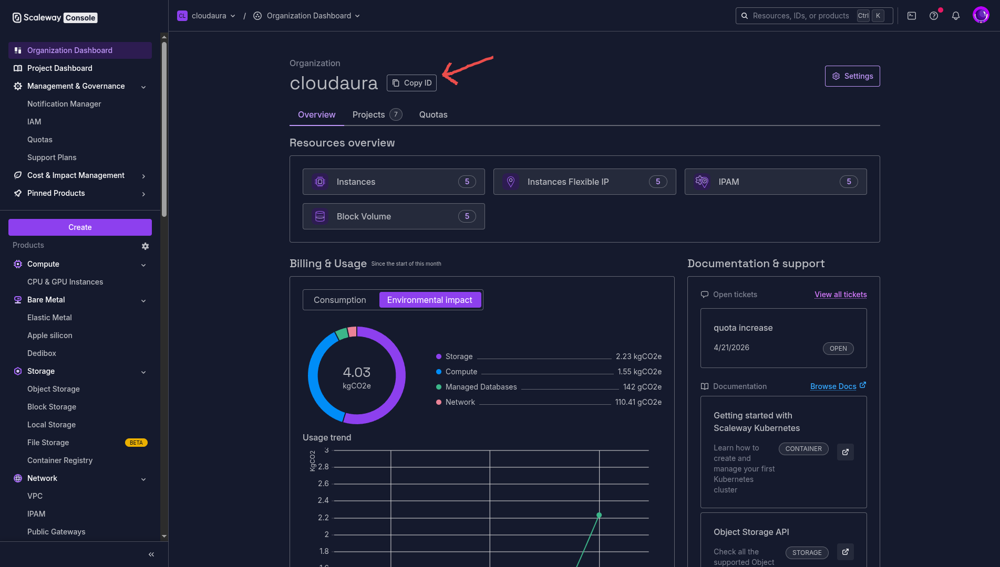
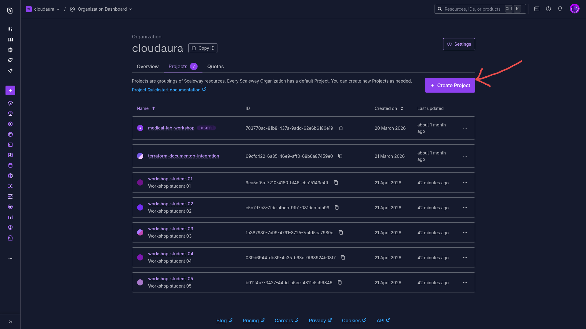
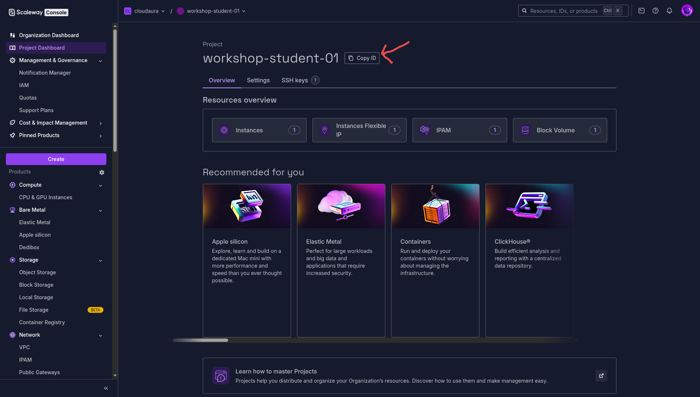
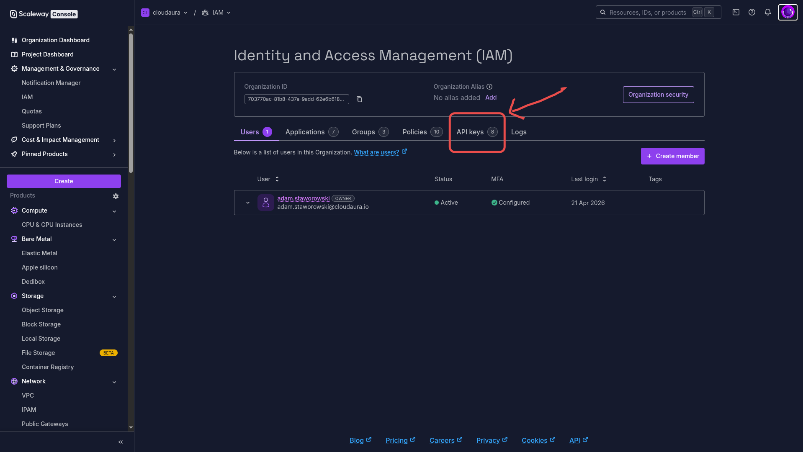
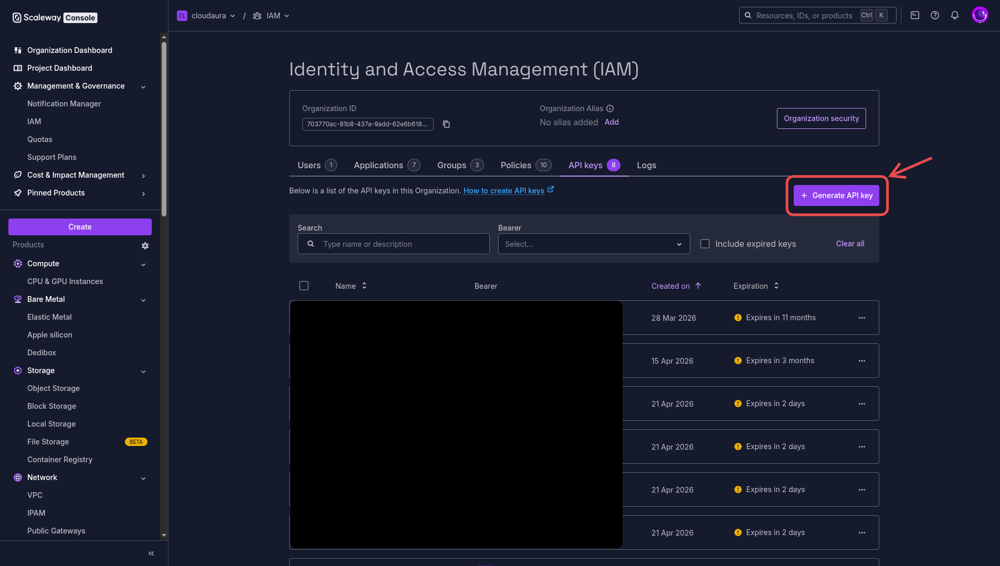
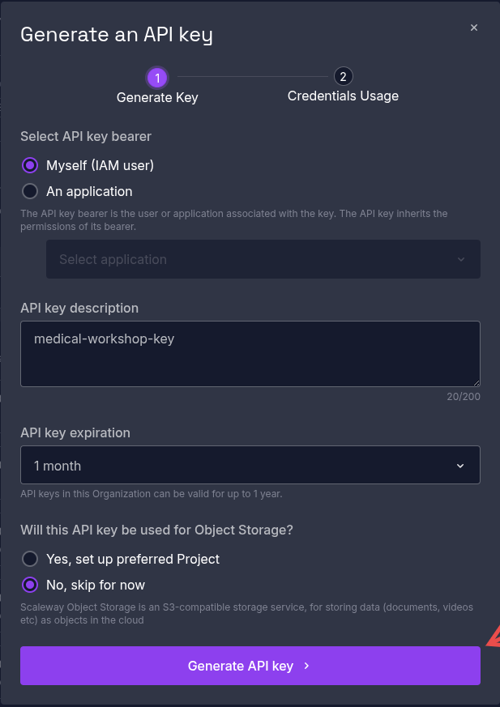
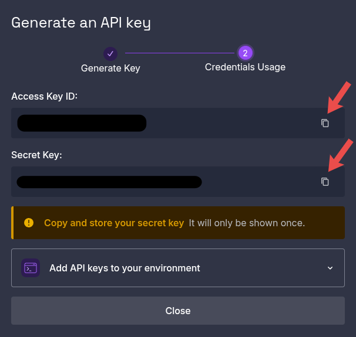

# Workshop Quickstart

Deploy the workshop environment — a per-student [JupyterLab](https://jupyter.org/) instance on Scaleway with the workshop notebooks pre-loaded. Nine steps: collect five values from the Scaleway console, paste them into `terraform.tfvars`, and run the deploy script.

> **This guide is for the workshop, not the main showcases lab.**
> To deploy the three production-style showcases (`infrastructure/`), follow the [main README](README.md#first-time-scaleway-account-setup) instead. All commands here operate on **`workshop/infrastructure/`** and **`workshop/scripts/`**.

**Before you start:** log in to [console.scaleway.com](https://console.scaleway.com/). No account yet? [Register here](https://account.scaleway.com/register) — company accounts get 100 EUR of credits.

---

## 1. Copy your Organization ID

Go to [console.scaleway.com/organization](https://console.scaleway.com/organization) and click **Copy ID** next to your organization name.



---

## 2. Create a Project

Go to [console.scaleway.com/organization/projects](https://console.scaleway.com/organization/projects) and click **+ Create Project** (top-right). Name it `medical-workshop` (or anything).



---

## 3. Copy your Project ID

Open the new project from the list. On the **Project Dashboard**, click **Copy ID** next to the project name.



---

## 4. Open IAM → API keys

Go to [console.scaleway.com/iam/users](https://console.scaleway.com/iam/users) and click the **API keys** tab.



---

## 5. Generate an API key

Click **+ Generate API key** (top-right).



Fill in the dialog:

- **Bearer:** *Myself (IAM user)*
- **Description:** `medical-workshop-key`
- **Expiration:** `1 year`
- **Object Storage preferred project:** *No, skip for now*



Click **Generate API key**.

---

## 6. Copy the Access Key ID and Secret Key

Click the copy icon next to each value:

- **Access Key ID** — starts with `SCW...`
- **Secret Key** — a UUID

> **The Secret Key is shown exactly once.** If you close this dialog without copying it, delete the key and generate a fresh one.



---

## 7. Get your SSH public key

Print an existing key:

```bash
cat ~/.ssh/id_ed25519.pub
```

Or generate one first:

```bash
ssh-keygen -t ed25519 -C "you@example.com" && cat ~/.ssh/id_ed25519.pub
```

Copy the one-line output (starts with `ssh-ed25519 AAAA...`).

---

## 8. Fill in `workshop/infrastructure/terraform.tfvars`

```bash
cp workshop/infrastructure/terraform.tfvars.example workshop/infrastructure/terraform.tfvars
```

Open the new file and paste each value:

```hcl
access_key      = "SCWXXXXXXXXXXXXXXXXX"                   # step 6
secret_key      = "xxxxxxxx-xxxx-xxxx-xxxx-xxxxxxxxxxxx"   # step 6
organization_id = "xxxxxxxx-xxxx-xxxx-xxxx-xxxxxxxxxxxx"   # step 1
project_id      = "xxxxxxxx-xxxx-xxxx-xxxx-xxxxxxxxxxxx"   # step 3
ssh_public_key  = "ssh-ed25519 AAAA..."                    # step 7
```

The file is already gitignored — do not commit it.

---

## 9. Deploy

```bash
bash workshop/scripts/deploy.sh
```

The script provisions the instance and polls until JupyterLab is reachable. When it finishes, it prints the URL and access token.

Tear everything down with:

```bash
bash workshop/scripts/destroy.sh
```

---

## Troubleshooting

**Secret Key not shown** — it's revealed once. Delete the key under **IAM → API keys** and generate a fresh one.

**`ssh_public_key` invalid** — paste `~/.ssh/id_ed25519.pub` (public key, starts with `ssh-ed25519`) — **not** the private key.

**TLS pending / 404 briefly** — Let's Encrypt issuance takes 30–90s after the instance boots. Wait a minute and retry the JupyterLab URL.

**Quota errors** — rare for the workshop (one `PRO2-XXS` + one public IP). If you hit one: Console → **Support → Account → Quotas** → request an increase.
