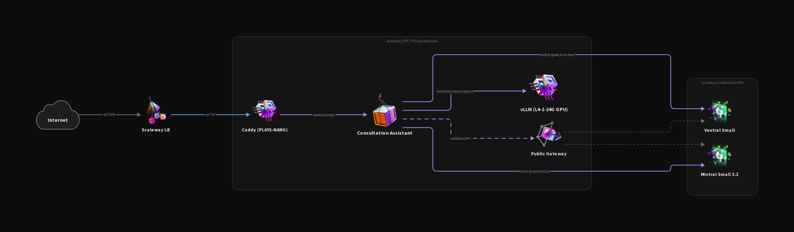
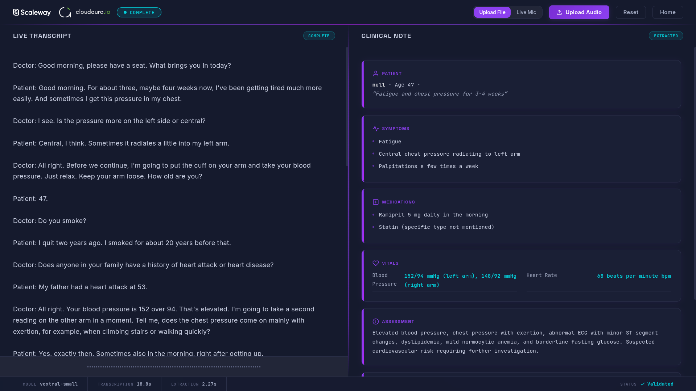
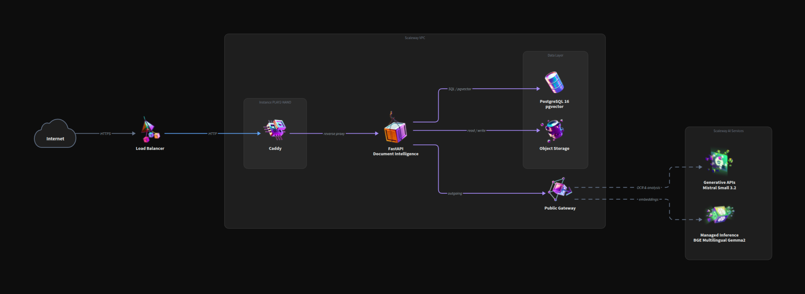
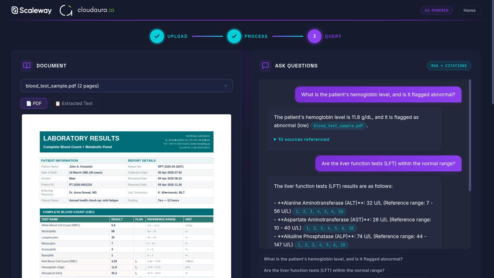
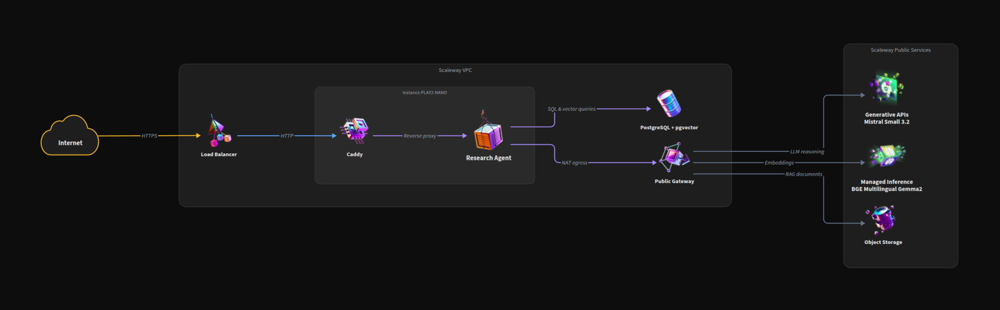
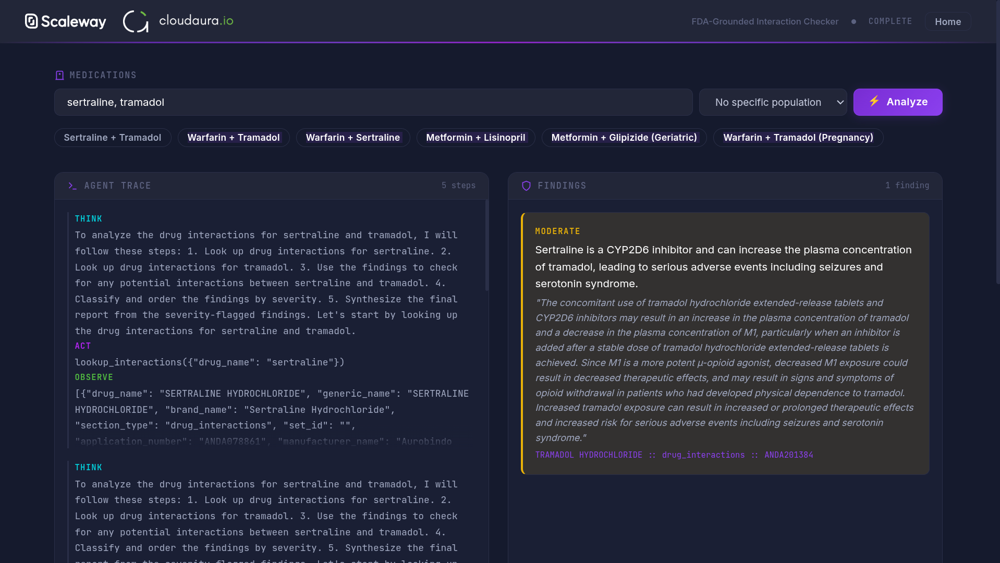

# Scaleway Medical AI Lab

Workshop materials for a **[Scaleway](https://www.scaleway.com/) x [cloudaura.io](https://cloudaura.io/)** hands-on session on building healthcare AI applications. The lab demonstrates how to use Scaleway's sovereign European cloud infrastructure and [Mistral AI](https://mistral.ai/) models to solve real medical use cases: speech transcription, document understanding, and multi-domain research agents. All patient data stays in Europe, on infrastructure you control.

> **Attending the workshop?** Follow the [**Workshop Quickstart**](QUICKSTART.md) for a step-by-step walkthrough, creating a project, generating an API key, SSH key, and filling in `workshop/infrastructure/terraform.tfvars` to spin up a per-student JupyterLab. (To deploy the showcases lab instead, see the [First-time Scaleway account setup](#first-time-scaleway-account-setup) section below.)

## What's in this repo

Three self-contained showcase applications, each demonstrating a different Scaleway AI capability applied to healthcare:

| # | Showcase | What it does | Scaleway services | Models |
|---|----------|-------------|-------------------|--------|
| 1 | **[Consultation Assistant](https://github.com/cloudaura-io/medical-on-scaleway/tree/main/01_consultation_assistant)** | Transcribes doctor-patient conversations (file upload or realtime WebSocket streaming) and extracts structured clinical data | Generative APIs, GPU Instance (L4 + vLLM) | Voxtral Small 24B (STT), Voxtral Mini 4B Realtime (streaming STT), Mistral Small 3.2 24B (extraction) |
| 2 | **[Document Intelligence](https://github.com/cloudaura-io/medical-on-scaleway/tree/main/02_document_intelligence)** | Vision extraction on scanned medical documents, indexes them, answers questions with citations | Generative APIs, Managed Inference, PostgreSQL + pgvector, Object Storage | Mistral Small 3.2 24B (vision + answers), Qwen3 Embedding 8B (embeddings) |
| 3 | **[Drug Interactions](https://github.com/cloudaura-io/medical-on-scaleway/tree/main/03_drug_interactions)** | ReAct agent that analyzes drug-drug and drug-population interactions against openFDA drug labels with cited evidence | Generative APIs, Managed Inference, PostgreSQL + pgvector | Mistral Small 3.2 24B (agent + tool calling), Qwen3 Embedding 8B (embeddings) |

A Scaleway account with API keys is required to run the showcases. [Register for a free Scaleway account](https://account.scaleway.com/register), company accounts get 100 EUR of credits to test the platform.

## Architecture

Everything runs inside a **Scaleway VPC** with a single **HTTPS entry point**. TLS is terminated at the Load Balancer via Let's Encrypt. Caddy handles path-based routing on the app instance. No public IPs on any compute instance - all outbound goes through a NAT gateway.

```
https://<domain>
         |
    Load Balancer (LB-S, Let's Encrypt)
    |   :443 HTTPS (all user traffic)
    |   :80  HTTP  (ACME challenge)
    |   :2201 SSH  (app instance, TCP passthrough)
    |   :2202 SSH  (GPU instance, TCP passthrough)
         |
    VPC / Private Network <vpc-cidr>  (defined in infrastructure/main.tf)
    |
    |-- NAT Gateway (VPC-GW-S) -- outbound internet for all instances
    |
    |-- App Instance (PLAY2-NANO, no public IP)
    |   Docker Compose: Caddy + 3 showcases
    |   /                         -> landing page
    |   /consultation-assistant/* -> FastAPI :8001
    |   /document-intelligence/*  -> FastAPI :8002
    |   /drug-interactions/*      -> FastAPI :8003
    |       |               |              |
    |       v               v              v
    |-- PostgreSQL      Managed        GPU Instance
    |   + pgvector      Inference      L4-1-24G
    |   DB-DEV-S        Qwen3 emb.     vLLM :8000
    |   :5432           L4 GPU         Voxtral Mini
    |   (private)       (private)      4B Realtime
    |
    External (via NAT gateway):
    Object Storage (S3)  |  Generative APIs  |  Container Registry
```

### Network security model

All instances have **no public IP**. Outbound internet goes through the NAT gateway. Security groups on each instance restrict inbound to the VPC CIDR (defined in `infrastructure/main.tf`) - only the Load Balancer (on the private network) can reach application ports. SSH access is via LB TCP passthrough on ports 2201 (app) and 2202 (GPU).

### AI services

| Service | Managed by | Infrastructure | Model | Params | Purpose |
|---------|-----------|----------------|-------|--------|---------|
| **Generative APIs** | Scaleway (serverless) | Shared, pay-per-token | `mistral-small-3.2-24b-instruct-2506` | 24B | Chat, extraction, vision (document text + layout), agent tool calling |
| **Generative APIs** | Scaleway (serverless) | Shared, pay-per-token | `voxtral-small-24b-2507` | 24.3B | Speech-to-text (file upload mode, diarized) |
| **Managed Inference** | Scaleway (dedicated) | Dedicated L4 GPU | `qwen3-embedding-8b` | 8B | Text embeddings (768-dim) for RAG |
| **Self-hosted vLLM** | You (raw GPU VM) | Dedicated L4-1-24G GPU | `Voxtral-Mini-4B-Realtime-2602` | 4B | Real-time streaming STT via WebSocket |

### Docker deployment flow

A single `Dockerfile` builds one image for all three showcases. It's tagged three times and pushed to Scaleway Container Registry:

```
1. Your machine:   docker build -> tag 3x -> push to registry
2. App instance:   cloud-init: wait for network -> install Docker -> registry login
                   -> docker compose pull -> docker compose up (~2 min)
```

Cloud-init retries `docker compose pull` every 30 seconds until images become available (they're pushed after `tofu apply` completes).

### Per-showcase architecture

#### Consultation Assistant

Audio -> [Generative APIs](https://www.scaleway.com/en/docs/generative-apis/) ([Voxtral Small](https://www.scaleway.com/en/docs/generative-apis/reference-content/supported-models/) STT) -> transcript -> Generative APIs ([Mistral Small 3.2](https://www.scaleway.com/en/docs/generative-apis/reference-content/supported-models/)) -> clinical JSON. Live mic mode streams via WebSocket to the [GPU](https://www.scaleway.com/en/docs/gpu/) vLLM instance (Voxtral Mini 4B Realtime) on the [private network](https://www.scaleway.com/en/docs/vpc/).



> **Models:** Voxtral Small 24B · Voxtral Mini 4B Realtime · Mistral Small 3.2 24B



#### Document Intelligence

PDF -> [Object Storage](https://www.scaleway.com/en/docs/object-storage/) (S3 via [NAT](https://www.scaleway.com/en/docs/public-gateways/)) -> [Generative APIs](https://www.scaleway.com/en/docs/generative-apis/) ([Mistral Small 3.2](https://www.scaleway.com/en/docs/generative-apis/reference-content/supported-models/) vision) -> [Managed Inference](https://www.scaleway.com/en/docs/managed-inference/) ([Qwen3 embeddings](https://www.scaleway.com/en/docs/managed-inference/reference-content/model-catalog/), private) -> [PostgreSQL](https://www.scaleway.com/en/docs/managed-databases-for-postgresql-and-mysql/) pgvector (private) -> Generative APIs (Mistral Small 3.2 cited answer).



> **Models:** Mistral Small 3.2 24B · Qwen3 Embedding 8B (768-dim)



#### Drug Interactions

Medications + population -> [Generative APIs](https://www.scaleway.com/en/docs/generative-apis/) ([Mistral Small 3.2](https://www.scaleway.com/en/docs/generative-apis/reference-content/supported-models/) ReAct agent + tool calling) -> [Managed Inference](https://www.scaleway.com/en/docs/managed-inference/) ([Qwen3 embeddings](https://www.scaleway.com/en/docs/managed-inference/reference-content/model-catalog/), private) + [pgvector](https://www.scaleway.com/en/docs/managed-databases-for-postgresql-and-mysql/) (private, seeded with openFDA drug labels) -> cited, severity-ranked findings streamed via SSE.



> **Models:** Mistral Small 3.2 24B · Qwen3 Embedding 8B (768-dim)



## First-time Scaleway account setup

One-time bootstrap required before any `tofu` commands work. Skip if you already have an account, an API key, and know your Organization + Project IDs.

1. **Create an account** at [account.scaleway.com/register](https://account.scaleway.com/register) and validate a payment method, GPU quotas require it.

2. **Create a project** (recommended), Console → top-left project dropdown → **+ Create project** (e.g. `medical-lab`). Resources will be namespaced under this project and can be torn down cleanly later.

3. **Generate an API key**, Console → top-right avatar → **IAM** → **API Keys** → **Generate API key**:
   - **Bearer:** *Myself (IAM user)*, simplest for solo setups
   - **Description:** `tofu-bootstrap`
   - **Expiration:** 1 year (rotate or shorten as you prefer)
   - **Object Storage preferred project:** *No, skip*, Terraform sets up buckets explicitly
   - Click **Generate** → copy both **Access Key** (`SCW...`) and **Secret Key** (UUID). The secret is shown **once only**.

4. **Copy your IDs:**
   - **Organization ID** → Console → **IAM** → top of the page, click the copy icon
   - **Project ID** → Console → **Project Dashboard** → **Settings** → Project ID
   - (On brand-new accounts these may be the same UUID, Scaleway sometimes seeds the default project with the org ID.)

5. **Paste the four values** into:

   **`infrastructure/terraform.tfvars`** (start from `terraform.tfvars.example`):
   ```hcl
   access_key      = "SCW..."                                 # step 3
   secret_key      = "xxxxxxxx-xxxx-xxxx-xxxx-xxxxxxxxxxxx"   # step 3
   organization_id = "xxxxxxxx-xxxx-xxxx-xxxx-xxxxxxxxxxxx"   # step 4
   project_id      = "xxxxxxxx-xxxx-xxxx-xxxx-xxxxxxxxxxxx"   # step 4
   ```

   **`workshop/infrastructure/terraform.tfvars`** (only if running the workshop track, same four credentials, plus `ssh_public_key` from `cat ~/.ssh/id_ed25519.pub`).

   Resource names are auto-derived from `project_id` (first 8 chars), no manual naming needed.

6. **Request quotas** (new accounts start with 0 GPU capacity). Console → **Support → Account → Quotas**, request:
   - L4-1-24G GPU instances: **1**
   - Managed Inference L4 dedicated deployments: **1**
   - Public Load Balancer, Public Gateway, DB-DEV-S: **1** each

   Some accounts get auto-granted, try `tofu apply` first; if it fails with a quota error, open the ticket. GPU approvals typically take 1-2 business days.

## Quick start

### Showcases (main lab)

```bash
cp infrastructure/terraform.tfvars.example infrastructure/terraform.tfvars
# Edit with your 4 Scaleway credentials (see First-time setup above)

bash scripts/deploy.sh      # provisions ~34 resources, builds Docker images, waits for health
bash scripts/destroy.sh     # tears down everything
```

The deploy script handles `tofu init`, `tofu apply`, Docker image build+push, and health polling. When it finishes, it prints the URLs for all three showcases.

### Workshop (per-student JupyterLab)

```bash
cp workshop/infrastructure/terraform.tfvars.example workshop/infrastructure/terraform.tfvars
# Edit with your 4 Scaleway credentials + ssh_public_key

bash workshop/scripts/deploy.sh      # provisions instance, waits for health, prints JupyterLab URL
bash workshop/scripts/destroy.sh     # tears down everything
```

### TLS / domain name

By default, `domain_name` is empty and the lab auto-generates a free HTTPS domain using [sslip.io](https://sslip.io/), a public DNS service that maps any IP address to a hostname (e.g. `<your-lb-ip-with-dashes>.sslip.io`). Let's Encrypt issues a certificate automatically. No DNS configuration needed.

To use a custom domain instead, set `domain_name` in your `terraform.tfvars`:

```hcl
domain_name = "lab.example.com"
```

With a custom domain, `tofu apply` will fail at the certificate step until a DNS A record points your domain to the Load Balancer IP. Check `tofu output lb_public_ip` for the IP, create the A record, then re-run `tofu apply`.

### Redeploy after code changes

```bash
docker build --no-cache -t medical-lab-base:latest .
bash scripts/build-push-images.sh
cd infrastructure && tofu apply -replace=scaleway_instance_server.app
```

### Local development

```bash
pip install -r requirements.txt
cd 01_consultation_assistant && uvicorn main:app --reload --port 8000
```

## Medical AI safety

All showcases implement layered trustworthiness patterns:

- **Grounded RAG with citations**: every medical claim references a source document
- **Structured output validation**: Mistral's native JSON schema mode guarantees valid data
- **Human-in-the-loop**: AI outputs are suggestions, not decisions
- **Chain-of-Verification**: claims are independently fact-checked against the knowledge base
- **Audit logging**: all queries, responses, and sources are recorded

## Prerequisites

- Docker (for building and pushing showcase images)
- OpenTofu 1.5+ (for infrastructure provisioning)
- Python 3.11+ (`pip install -r requirements.txt`)
- A [Scaleway account](https://account.scaleway.com/register) with API keys

## License

Copyright 2026 cloudaura.io. Licensed under the [Apache License, Version 2.0](LICENSE).
